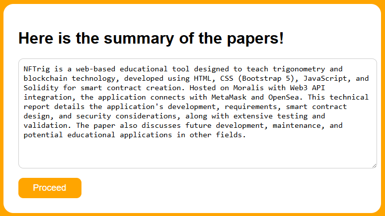
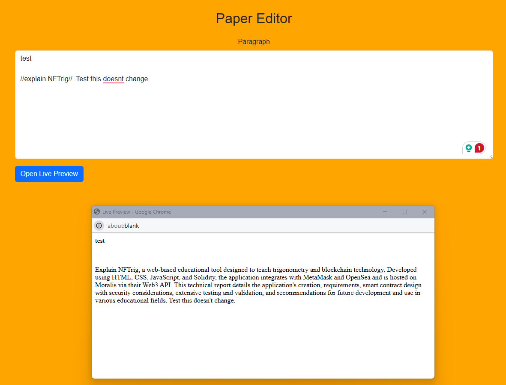

#  Context-Aware Texting (CAT) when making Academic Paper 
**by Toko Miura, Aoi Kataura, Chu Yannan & Eka Sulistyawan**

We addressed:
1. The need of a **context-aware GPT response particularly during writing academic paper**. The solution lies in three preceeding steps before the actual inference, i.e., pooling paper database & summarization.
2. **Simplified typing experience** by directly incorporating prompting back-end on the text editing platform.


## Pooling paper & paper summarization


This step requires you to input Arxiv or DOI as a list, so that the software could access the *abstract*. Be reminded that the current version fetch **only the abstract** to avoid the need of extra API for exclusive full-content of the paper. Abstract is easily available. Further, web-scraping is not implemented.

Two buttons:
1. Fetch abstract $\rightarrow$ pool the abstract
2. Proceed $\rightarrow$ summarize the abstract



Here, you will see the LLM summarized the abstract already!

Prompt design:
```
"You are an AI assistant that summarizes scientific papers clearly and concisely.\n\n"
f"Please summarize the following paper abstracts in a concise way:\n\n{abstracts_text}\n\n"
"Made it one paragraph long."
```

One button:
1. Proceed $\rightarrow$ supply the summary to the editorS

## Editing software with direct GPT back-end



This step gives a textarea for you to write paragraph. Some few features include
1. Double enters immediately submit the text to the backend.
2. Any text inside double slash `// ... //` is subject to LLM.

Prompt design:
```
f"You are an expert AI editor. Refine only the text inside {pattern} in the following paragraph, "
"and return the entire paragraph enclosed by <p></p> with your refinement applied.\n"
f"'{paragraph}'\n\n"
f"Text to refine: '{target_text}'\n\n"
"Refinement should:\n"
"- Improve grammar, punctuation, and clarity\n"
"- Maintain the original meaning\n"
"- Enhance tone for professional and academic readability\n"
"- Use relevant references if available\n\n"
f"References:\n{request.session.get('abstract.summary', ref_text)}\n\n"
"If no reference is relevant, say 'UNABLE TO ADD REFERENCE'. "
"Return only the refined paragraph without extra commentary."
```